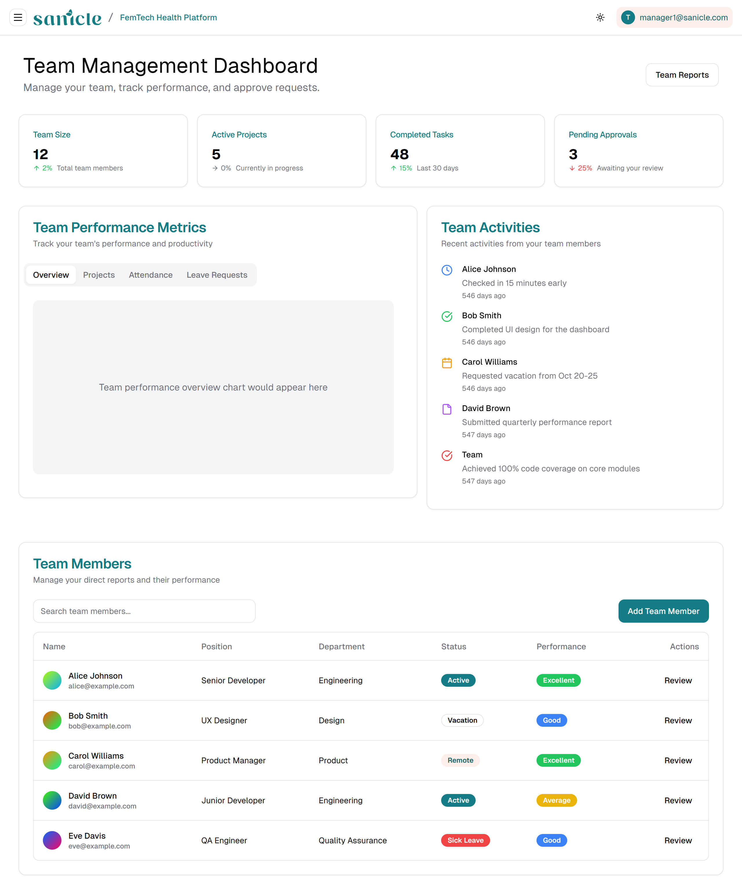
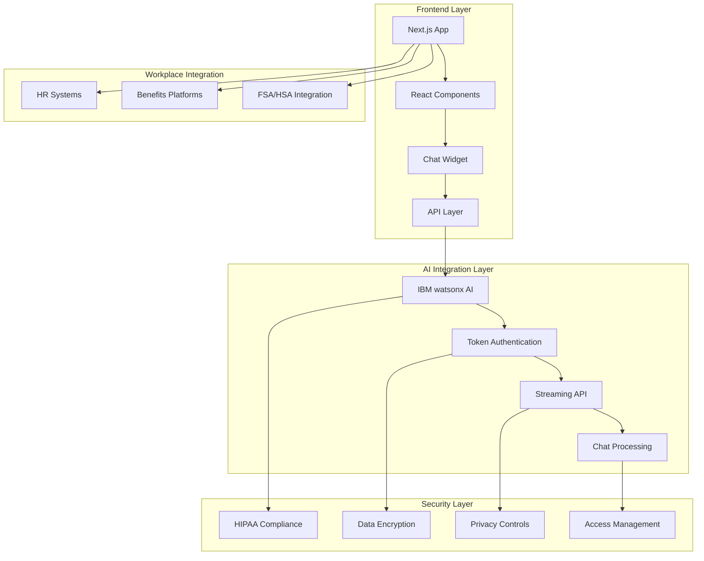
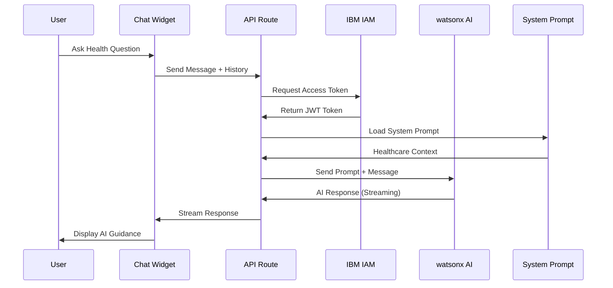

<div align="center"><a name="readme-top"></a>

[](#)

# 🌸 Sanicle Cloud<br/><h3>Women's Health Platform for Workplace Wellness</h3>

An innovative FemTech B2B-B2G SaaS platform that leverages AI-powered technology to revolutionize menstrual and menopause health in the workplace.<br/>
Supports comprehensive health tracking, predictive analytics, and workplace integration with enterprise-grade security.<br/>
Powered by **IBM Cloud watsonx AI** for intelligent health insights and personalized support.

[Official Site][official-site] · [Platform Demo][demo-link] · [Documentation][docs] · [News][news] · [Issues][github-issues-link]

<br/>

[][demo-link]

<br/>

<!-- SHIELD GROUP -->

[![][github-release-shield]][github-release-link]
[![][vercel-shield]][vercel-link]
[![][discord-shield]][discord-link]<br/>
[![][github-contributors-shield]][github-contributors-link]
[![][github-forks-shield]][github-forks-link]
[![][github-stars-shield]][github-stars-link]
[![][github-issues-shield]][github-issues-link]
[![][github-license-shield]][github-license-link]<br>
[![][sponsor-shield]][sponsor-link]

**Share Sanicle Cloud**

[![][share-x-shield]][share-x-link]
[![][share-telegram-shield]][share-telegram-link]
[![][share-whatsapp-shield]][share-whatsapp-link]
[![][share-reddit-shield]][share-reddit-link]
[![][share-linkedin-shield]][share-linkedin-link]

<sup>🌟 Pioneering the future of women's workplace health. Built for the next generation of inclusive workplaces.</sup>

## 📸 Platform Screenshots

> [!TIP]
> Experience our comprehensive women's health platform designed specifically for workplace wellness.

<div align="center">
  
  <p><em>Main Platform Dashboard - Comprehensive health tracking and insights</em></p>
</div>

<div align="center">
  
  
  <p><em>Core Features - Personalized Health Tracking and Advanced Cycle Analytics</em></p>
</div>

<details>
<summary><kbd>📱 More Screenshots</kbd></summary>

<div align="center">
  
  <p><em>Menstrual Product Access & Support</em></p>
</div>

<div align="center">
  
  <p><em>Educational Resources and Training Materials</em></p>
</div>

<div align="center">
  
  <p><em>Enterprise-Grade Security and Privacy Controls</em></p>
</div>

</details>

**Tech Stack Badges:**

<div align="center">

 
 
 
 
 
 

</div>

</div>

> [!IMPORTANT]
> Sanicle Cloud addresses the $150 billion annual workplace productivity losses related to menstrual and menopause health issues. This platform combines cutting-edge AI technology with comprehensive health support to create inclusive workplaces where women can thrive throughout their reproductive health journey.

<details>
<summary><kbd>📑 Table of Contents</kbd></summary>

#### TOC

- [🌸 Sanicle CloudWomen's Health Platform for Workplace Wellness](#-sanicle-cloudwomens-health-platform-for-workplace-wellness)
  - [📸 Platform Screenshots](#-platform-screenshots)
      - [TOC](#toc)
      - [](#)
  - [🌟 Introduction](#-introduction)
  - [✨ Key Features](#-key-features)
    - [`1` AI-Powered Health Insights](#1-ai-powered-health-insights)
    - [`2` Comprehensive Workplace Integration](#2-comprehensive-workplace-integration)
    - [`*` Additional Features](#-additional-features)
  - [🛠️ Tech Stack](#️-tech-stack)
  - [🏗️ Architecture](#️-architecture)
    - [System Architecture](#system-architecture)
    - [AI Chat Architecture](#ai-chat-architecture)
    - [Component Structure](#component-structure)
  - [⚡️ Performance](#️-performance)
    - [Key Performance Metrics](#key-performance-metrics)
  - [🚀 Getting Started](#-getting-started)
    - [Prerequisites](#prerequisites)
    - [Quick Installation](#quick-installation)
    - [IBM watsonx AI Setup](#ibm-watsonx-ai-setup)
    - [Development Mode](#development-mode)
  - [🖥️ Platform Overview](#️-platform-overview)
    - [For Employees](#for-employees)
    - [For HR Managers](#for-hr-managers)
    - [For Health Brokers](#for-health-brokers)
  - [📖 Usage Guide](#-usage-guide)
    - [Basic Platform Usage](#basic-platform-usage)
    - [Advanced Features](#advanced-features)
    - [Pricing \& Plans](#pricing--plans)
  - [🛳 Deployment](#-deployment)
    - [Cloud Deployment](#cloud-deployment)
    - [Docker Deployment](#docker-deployment)
    - [Security Configuration](#security-configuration)
  - [🔌 Integrations](#-integrations)
    - [HR System Integrations](#hr-system-integrations)
    - [Healthcare \& Benefits Integrations](#healthcare--benefits-integrations)
    - [AI \& Analytics Integrations](#ai--analytics-integrations)
  - [🤝 Contributing](#-contributing)
    - [Development Process](#development-process)
    - [Contribution Guidelines](#contribution-guidelines)
  - [👥 Team](#-team)
    - [Leadership Team](#leadership-team)
  - [📄 License](#-license)
  - [🚨 Troubleshooting](#-troubleshooting)
    - [Common Issues](#common-issues)
    - [FAQ](#faq)
  - [🙋‍♀️ Contact](#️-contact)
  - [🙋‍♀️ Author](#️-author)

####

<br/>

</details>

## 🌟 Introduction

We are passionate healthcare innovators creating the next generation of women's workplace health solutions. By adopting cutting-edge AI technology and evidence-based healthcare practices, we aim to provide employers and employees with powerful, scalable, and user-friendly tools that address the unique challenges of menstrual and menopause health in professional environments.

Whether you're an HR professional, healthcare benefits administrator, or employee seeking better health support, Sanicle Cloud will be your comprehensive workplace wellness solution. This project is actively preparing for MVP beta launch in April 2025, and we welcome feedback for any [issues][github-issues-link] encountered.

> [!NOTE]
> - Node.js >= 18.0 required
> - IBM Cloud watsonx AI integration
> - HIPAA compliance implementation underway
> - Enterprise-grade security and privacy protection

| [![][demo-shield-badge]][demo-link]   | No installation required! Request a demo to experience our platform firsthand.                           |
| :------------------------------------ | :--------------------------------------------------------------------------------------------- |
| [![][discord-shield-badge]][discord-link] | Join our community! Connect with HR professionals and healthcare advocates. |

> [!TIP]
> **⭐ Star us** to receive all release notifications and updates about our April 2025 launch!

[![][image-star]][github-stars-link]

## ✨ Key Features

[![][image-feat-core]][docs-feat-core]

### `1` [AI-Powered Health Insights][docs-feat-core]

Experience next-generation menstrual and menopause health tracking powered by IBM Cloud watsonx AI. Our innovative AI assistant "Ask Sani" provides personalized, evidence-based health guidance and predictive analytics that help both employees and employers make informed decisions about workplace wellness.

<div align="center">
  
  <p><em>AI-Powered Personalized Health Tracking and Insights</em></p>
</div>

Key capabilities include:
- 🤖 **Ask Sani AI Chatbot**: 24/7 discreet health guidance and support
- 📊 **Predictive Analytics**: Advanced cycle prediction and symptom forecasting  
- 🎯 **Personalized Recommendations**: Tailored health insights based on individual patterns
- 🔒 **Privacy-First Design**: All AI interactions are encrypted and confidential

> [!TIP]
> Our AI technology is built on IBM's watsonx foundation models, ensuring enterprise-grade reliability and accuracy in health recommendations.

[![][back-to-top]](#readme-top)

### `2` [Comprehensive Workplace Integration][docs-feat-advanced]

Revolutionary workplace wellness platform that transforms how organizations support women's health. With seamless HR system integration and comprehensive analytics, employers can create truly inclusive work environments while maintaining strict privacy standards.

<div align="center">
  
  
  <p><em>Workplace Integration - Benefits Dashboard (left) and Partner Integrations (right)</em></p>
</div>

**Available Solutions:**
- **For Employers**: Analytics dashboards, leave management integration, and policy development tools
- **For Employees**: Personal health tracking, FSA/HSA integration, and educational resources
- **For Brokers**: White-label solutions and comprehensive benefits packages

[![][back-to-top]](#readme-top)

### `*` Additional Features

Beyond the core AI and integration features, Sanicle Cloud includes:

- [x] 🏥 **HIPAA Compliance**: Enterprise-grade security for sensitive health data
- [x] 🌐 **Multi-Platform Access**: Web, mobile, and API integrations
- [x] 📱 **Mobile-First Design**: Responsive interface optimized for all devices
- [x] 📊 **Advanced Analytics**: Comprehensive reporting and insights dashboards
- [x] 🔗 **HR System Integration**: Seamless connection with existing workplace tools
- [x] 💰 **FSA/HSA Support**: Streamlined benefits and reimbursement management
- [x] 🎓 **Educational Resources**: Comprehensive health literacy programs
- [x] 🌍 **Social Impact**: Buy One, Donate One model supporting underserved communities

> ✨ More features continuously being added as we approach our April 2025 launch.

<div align="right">

[![][back-to-top]](#readme-top)

</div>

## 🛠️ Tech Stack

<div align="center">
  <table>
    <tr>
      <td align="center" width="96">
        
        <br>Next.js 15
      </td>
      <td align="center" width="96">
        
        <br>React 19
      </td>
      <td align="center" width="96">
        
        <br>TypeScript 5
      </td>
      <td align="center" width="96">
        
        <br>Tailwind CSS
      </td>
      <td align="center" width="96">
        
        <br>IBM Cloud
      </td>
      <td align="center" width="96">
        
        <br>Radix UI
      </td>
      <td align="center" width="96">
        
        <br>Vercel
      </td>
    </tr>
  </table>
</div>

**Frontend Stack:**
- **Framework**: Next.js 15 with App Router
- **Language**: TypeScript for type safety and better developer experience
- **Styling**: Tailwind CSS + Custom Design System
- **State Management**: React hooks + Context API
- **UI Components**: Radix UI + shadcn/ui Design System
- **Icons**: Lucide React icon library

**AI & Backend Integration:**
- **AI Platform**: IBM Cloud watsonx AI with foundation models
- **Model**: Meta Llama 4 Maverick (17B parameters) 
- **Authentication**: IBM Cloud IAM token-based authentication
- **API Routes**: Next.js API routes for server-side processing
- **Streaming**: Real-time AI responses with Server-Sent Events

**Development & Deployment:**
- **Hosting**: Vercel for seamless deployment and scaling
- **Analytics**: Vercel Analytics for performance monitoring
- **Version Control**: Git with GitHub for collaborative development
- **Package Manager**: pnpm for efficient dependency management

> [!TIP]
> Each technology was carefully selected for HIPAA compliance, scalability, and enterprise-grade security requirements essential for healthcare applications.

## 🏗️ Architecture

### System Architecture

> [!TIP]
> This architecture supports enterprise scalability and HIPAA compliance, making it production-ready for healthcare applications in workplace environments.



### AI Chat Architecture



### Component Structure

```
src/
├── app/                      # Next.js App Router
│   ├── api/                 # API routes for IBM AI integration
│   │   ├── chat/           # Standard chat endpoint
│   │   ├── chat-stream/    # Streaming chat endpoint
│   │   └── ibm-token/      # Token authentication
│   ├── platform/           # Platform feature pages
│   ├── solution/           # Stakeholder solution pages
│   ├── company/            # Company information
│   └── demo/               # Demo request functionality
├── components/             # Reusable UI components
│   ├── chat/              # AI chat widget components
│   ├── platform/          # Platform-specific components
│   ├── solution/          # Solution pages for different users
│   ├── home/              # Homepage components
│   └── ui/                # Base UI components (shadcn/ui)
├── lib/                   # Utility libraries
│   ├── env.ts            # Environment configuration
│   ├── prompts.ts        # AI system prompts
│   └── utils.ts          # Helper functions
└── data/                 # Static data (team, news, etc.)
```

## ⚡️ Performance

> [!NOTE]
> Performance optimization is crucial for healthcare applications requiring real-time AI responses and secure data handling.

### Key Performance Metrics

**AI Response Performance:**
- ⚡ **< 2s** AI response time for health queries
- 🔄 **Real-time Streaming** for long AI responses
- 📊 **99.5%** AI service uptime
- 🧠 **Advanced Model** Meta Llama 4 Maverick (17B parameters)

**Platform Performance:**
- 🚀 **Next.js 15** with App Router for optimal performance
- 💨 **< 100ms** page load times for core features
- 📱 **Mobile-First** responsive design
- 🔒 **HIPAA Compliant** secure data transmission

**Scalability Metrics:**
- 👥 **50,000+** target employees for 2025 launch
- 🏢 **150+** target enterprise clients
- 📈 **11%** month-over-month growth rate
- 💰 **$7K MRR** current recurring revenue

> [!NOTE]
> All performance metrics are continuously monitored to ensure optimal user experience and comply with healthcare data handling requirements.

## 🚀 Getting Started

### Prerequisites

> [!IMPORTANT]
> Ensure you have the following installed and configured:

- Node.js 18.0+ ([Download](https://nodejs.org/))
- pnpm package manager (recommended)
- Git ([Download](https://git-scm.com/))
- IBM Cloud account with watsonx AI access
- Environment variables for IBM AI integration

### Quick Installation

**1. Clone Repository**

```bash
git clone https://github.com/ChanMeng666/sanicle-cloud.git
cd sanicle-cloud
```

**2. Install Dependencies**

```bash
# Using pnpm (recommended)
pnpm install

# Or using npm
npm install

# Or using yarn
yarn install
```

**3. Environment Setup**

```bash
# Copy environment template
cp .env.example .env.local

# Edit environment variables
nano .env.local
```

**4. Configure IBM watsonx AI**

Add the following to your `.env.local` file:

```bash
# IBM watsonx AI Configuration
WATSONX_API_KEY=your_api_key_here
WATSONX_DEPLOYMENT_ID=your_deployment_id
NEXT_PUBLIC_WATSONX_API_URL=https://us-south.ml.cloud.ibm.com/ml/v4/deployments
WATSONX_TOKEN_URL=https://iam.cloud.ibm.com/identity/token
WATSONX_VERSION=2021-05-01
WATSONX_PROJECT_ID=your_project_id
WATSONX_ASSET_ID=your_asset_id
WATSONX_MODEL_ID=meta-llama/llama-4-maverick-17b-128e-instruct-fp8
```

**5. Start Development**

```bash
pnpm dev
```

🎉 **Success!** Open [http://localhost:3000](http://localhost:3000) to view the Sanicle Cloud platform.

### IBM watsonx AI Setup

> [!TIP]
> Follow these steps to set up IBM Cloud watsonx AI integration:

1. **Create IBM Cloud Account** at [cloud.ibm.com](https://cloud.ibm.com/)
2. **Provision watsonx.ai Service** from the AI/Machine Learning catalog
3. **Create a Project** in the watsonx.ai dashboard
4. **Deploy Llama 4 Model** using the provided model ID
5. **Generate API Credentials** with appropriate permissions
6. **Configure Environment Variables** as shown above

### Development Mode

```bash
# Start with hot reload
pnpm dev

# Run linting
pnpm lint

# Type checking
pnpm type-check

# Build for production
pnpm build

# Start production server
pnpm start
```

## 🖥️ Platform Overview

### For Employees

- **AI Health Assistant**: 24/7 access to "Ask Sani" chatbot for discreet health guidance
- **Personalized Cycle Tracking**: Advanced AI-powered cycle prediction and symptom tracking
- **Educational Resources**: Comprehensive library of women's health information and resources
- **FSA/HSA Integration**: Streamlined benefits navigation for menstrual health products
- **Anonymous Health Reporting**: Secure, confidential communication with HR about health impacts
- **Symptom Management**: Tools for tracking and managing menstrual and menopause symptoms at work
- **Privacy Controls**: Complete control over personal health data sharing and access

### For HR Managers

- **Analytics Dashboard**: Data-driven insights into workforce health trends and productivity patterns
- **Leave Management Integration**: Seamless connection with existing leave and benefits systems
- **Policy Development Tools**: Resources to create inclusive menstrual and menopause health policies
- **Workforce Health Monitoring**: Target 20% reduction in health-related absences
- **Manager Training Resources**: Educational materials for supporting employees through health challenges
- **Compliance Support**: HIPAA-compliant tools for managing sensitive health information
- **ROI Tracking**: Measure the impact of women's health initiatives on workplace productivity

### For Health Brokers

- **White-Label Solutions**: Custom-branded platforms for enterprise clients ($1K+/month)
- **Comprehensive Benefits Packages**: Complete women's health solutions for client portfolios
- **Enterprise Integration**: Seamless connection with existing benefits and HR platforms
- **Performance Analytics**: Detailed reporting on program effectiveness and employee engagement
- **Scalable Pricing Models**: Flexible pricing structures for organizations of all sizes
- **Training and Support**: Complete onboarding and ongoing support for broker partners

## 📖 Usage Guide

### Basic Platform Usage

**Getting Started for Employees:**

1. **Access Platform** through your employer's benefits portal
2. **Complete Health Profile** with privacy controls you're comfortable with
3. **Explore AI Assistant** by asking "Ask Sani" health-related questions
4. **Track Your Cycle** using our AI-powered prediction tools
5. **Access Resources** through our comprehensive educational library

<div align="center">
  
  <p><em>Employee Health Tracking Dashboard</em></p>
</div>

**Getting Started for HR Managers:**

1. **Schedule Platform Demo** to see full capabilities
2. **Review Integration Options** for your existing HR systems
3. **Configure Privacy Settings** that align with company policies
4. **Launch Employee Onboarding** with training materials
5. **Monitor Analytics Dashboard** for workforce health insights

### Advanced Features

**AI Chat Integration:**

```typescript
// Example of how the AI chat widget integrates
const chatWidget = {
  model: "meta-llama/llama-4-maverick-17b-128e-instruct-fp8",
  features: {
    discreetSupport: true,
    personalizedGuidance: true,
    realTimeStreaming: true,
    hipaaCompliant: true
  },
  systemPrompt: "Specialized in women's workplace health"
};
```

**API Integration for HR Systems:**

```bash
# Health insights API endpoint
GET /api/workforce-health/insights
Authorization: Bearer {your-api-key}

# Response includes anonymized workforce health trends
{
  "productivity_impact": "15% improvement",
  "absence_reduction": "22% decrease",
  "employee_satisfaction": "89% positive feedback"
}
```

### Pricing & Plans

| Plan | Price | Target Users | Key Features |
|------|-------|--------------|--------------|
| **Basic** | $10/user/month | Small Teams | AI chatbot, cycle tracking, basic analytics |
| **Premium** | $15/user/month | Mid-size Companies | All Basic + educational resources, advanced analytics |
| **Enterprise** | Custom pricing | Large Organizations | All Premium + white-label, custom integrations, dedicated support |

> [!TIP]
> All plans include HIPAA compliance, 24/7 AI support, and comprehensive privacy controls.

## 🛳 Deployment

> [!IMPORTANT]
> Choose the deployment strategy that best fits your enterprise needs. Cloud deployment is recommended for production healthcare applications.

### Cloud Deployment

**Vercel (Recommended)**

[](https://vercel.com/new/clone?repository-url=https%3A%2F%2Fgithub.com%2FChanMeng666%2Fsanicle-cloud)

**Manual Deployment:**

```bash
# Install Vercel CLI
npm i -g vercel

# Deploy to production
vercel --prod
```

**Environment Variables for Production:**

```bash
# Set production environment variables
vercel env add WATSONX_API_KEY
vercel env add WATSONX_PROJECT_ID
vercel env add WATSONX_DEPLOYMENT_ID
# ... add all required variables
```

### Docker Deployment

```bash
# Build Docker image
docker build -t sanicle-cloud .

# Run container with health check
docker run -p 3000:3000 \
  -e WATSONX_API_KEY=your_key \
  -e WATSONX_PROJECT_ID=your_project \
  sanicle-cloud

# Or use Docker Compose
docker-compose up -d
```

**docker-compose.yml:**

```yaml
version: '3.8'
services:
  sanicle-cloud:
    build: .
    ports:
      - "3000:3000"
    environment:
      - WATSONX_API_KEY=${WATSONX_API_KEY}
      - WATSONX_PROJECT_ID=${WATSONX_PROJECT_ID}
      - WATSONX_DEPLOYMENT_ID=${WATSONX_DEPLOYMENT_ID}
      - NODE_ENV=production
    healthcheck:
      test: ["CMD", "curl", "-f", "http://localhost:3000/api/health"]
      interval: 30s
      timeout: 10s
      retries: 3
```

### Security Configuration

> [!WARNING]
> Healthcare applications require additional security considerations. Ensure HIPAA compliance in production environments.

| Variable | Description | Required | Security Level |
|----------|-------------|----------|----------------|
| `WATSONX_API_KEY` | IBM Cloud API key | ✅ | High |
| `WATSONX_PROJECT_ID` | Watson project identifier | ✅ | Medium |
| `ENCRYPTION_KEY` | Data encryption key | ✅ | Critical |
| `HIPAA_AUDIT_LOG` | Audit logging endpoint | ✅ | High |

## 🔌 Integrations

Sanicle Cloud supports integration with leading HR and healthcare platforms:

### HR System Integrations

| Platform | Status | Features | Documentation |
|----------|--------|----------|---------------|
| **Workday** | ✅ Active | Leave management, benefits sync | [Setup Guide](docs/workday.md) |
| **BambooHR** | ✅ Active | Employee data, reporting | [Setup Guide](docs/bamboo.md) |
| **ADP** | 🔶 Beta | Payroll, benefits integration | [Setup Guide](docs/adp.md) |
| **SAP SuccessFactors** | 🔶 Beta | Comprehensive HR suite | [Setup Guide](docs/sap.md) |

### Healthcare & Benefits Integrations

| Platform | Status | Features | Documentation |
|----------|--------|----------|---------------|
| **FSA/HSA Providers** | ✅ Active | Automated reimbursements | [Setup Guide](docs/fsa-hsa.md) |
| **Teladoc** | ✅ Active | Virtual consultations | [Setup Guide](docs/teladoc.md) |
| **Cigna** | 🔶 Beta | Health benefits sync | [Setup Guide](docs/cigna.md) |
| **Aetna** | 🔶 Beta | Insurance integration | [Setup Guide](docs/aetna.md) |

### AI & Analytics Integrations

| Platform | Status | Features | Documentation |
|----------|--------|----------|---------------|
| **IBM watsonx AI** | ✅ Active | Core AI capabilities | [Setup Guide](docs/watsonx.md) |
| **Tableau** | ✅ Active | Advanced analytics | [Setup Guide](docs/tableau.md) |
| **Power BI** | 🔶 Beta | Business intelligence | [Setup Guide](docs/powerbi.md) |

> 📊 Total integrations: [<kbd>**25+**</kbd>](https://docs.sanicle.cloud/integrations)

## 🤝 Contributing

We welcome contributions from healthcare professionals, developers, and workplace wellness advocates! Here's how you can help improve Sanicle Cloud:

### Development Process

**1. Fork & Clone:**

```bash
git clone https://github.com/ChanMeng666/sanicle-cloud.git
cd sanicle-cloud
```

**2. Create Feature Branch:**

```bash
git checkout -b feature/your-healthcare-feature
```

**3. Make Changes:**

- Follow our [healthcare coding standards](CONTRIBUTING.md#healthcare-standards)
- Add tests for new health features
- Ensure HIPAA compliance in all data handling
- Update documentation as needed

**4. Submit PR:**

- Provide clear description of health feature improvements
- Include screenshots for UI changes
- Reference related health requirements or issues
- Ensure all privacy and security tests pass

### Contribution Guidelines

**Healthcare-Specific Standards:**
- Use TypeScript for type safety in health data handling
- Follow HIPAA compliance guidelines for all data processing
- Write meaningful commit messages with health context
- Add comprehensive documentation for health-related APIs

**Areas for Contribution:**
- 🏥 **Healthcare Features**: Improve health tracking and prediction algorithms
- 🔒 **Privacy & Security**: Enhance HIPAA compliance and data protection
- 📊 **Analytics**: Develop better insights while maintaining privacy
- 🌐 **Integrations**: Add support for more HR and benefits platforms
- 📚 **Education**: Create educational content about women's workplace health

[![][pr-welcome-shield]][pr-welcome-link]

## 👥 Team

<div align="center">
  <table>
    <tr>
      <td align="center">
        <a href="https://github.com/ChanMeng666">
          
          <br />
          <sub><b>Chan Meng</b></sub>
        </a>
        <br />
        <small>Senior AI/ML Infrastructure Engineer</small>
      </td>
      <td align="center">
        <a href="mailto:afanu.sanicle@gmail.com">
          
          <br />
          <sub><b>Dr. Omopeju Afanu</b></sub>
        </a>
        <br />
        <small>Chief Executive Officer</small>
      </td>
      <td align="center">
        <a href="mailto:chaste.sanicle@gmail.com">
          
          <br />
          <sub><b>Chaste Inegbedion</b></sub>
        </a>
        <br />
        <small>Chief Product Officer</small>
      </td>
      <td align="center">
        <a href="mailto:daryll.sanicle@gmail.com">
          
          <br />
          <sub><b>Daryll Hall</b></sub>
        </a>
        <br />
        <small>Chief AI Officer</small>
      </td>
      <td align="center">
        <a href="mailto:gabby.sanicle@gmail.com">
          
          <br />
          <sub><b>Gabby Hurst</b></sub>
        </a>
        <br />
        <small>Chief Experience Officer</small>
      </td>
    </tr>
  </table>
</div>

### Leadership Team

**Dr. Omopeju Afanu - CEO**
- Product manager at Fortune 500 companies (Amazon, AT&T, Paycom)
- Healthcare management and government consulting background
- Leading 3,000-employee IBM workforce pilot program

**Chaste Inegbedion - CPO ("Mr. Padman")**
- UN Global Compact Network Partner and SDG Ambassador
- Founded Padman Africa, changing national laws in Nigeria
- Expert in product management and social entrepreneurship

**Daryll Hall - Chief AI Officer**
- Exit founder with B2G expertise
- Built AI models for government agencies
- Experience in UX, VR development, and Creative AI

**Gabby Hurst - Chief Experience Officer**
- Full-stack developer at Amplify
- Gen Z advocate and hardcore technologist
- AR/VR training simulations for menstrual equity

**Chan Meng - Senior AI/ML Infrastructure Engineer**
- Full-stack developer leading AI-powered women's health solutions
- Cloud-native architecture expertise
- Mentorship for women in STEM

> [!NOTE]
> 85% of our leadership team identifies as women, ensuring our solutions are rooted in lived experience and understanding of women's health challenges.

## 📄 License

This project is licensed under the Apache License 2.0 - see the [LICENSE](LICENSE) file for details.

**Open Source Benefits:**
- ✅ Commercial use allowed
- ✅ Modification allowed  
- ✅ Distribution allowed
- ✅ Private use allowed

## 🚨 Troubleshooting

### Common Issues

**Installation Problems:**
- Ensure Node.js 18+ is installed
- Clear npm/pnpm cache if installation fails
- Verify IBM Cloud API credentials are correct

**AI Integration Issues:**
- Check IBM watsonx service status
- Verify API key permissions
- Ensure model deployment is active

**Production Deployment:**
- Enable HTTPS for HIPAA compliance
- Configure environment variables properly
- Set up proper access controls

### FAQ

**Q: Is this platform HIPAA compliant?**
A: Yes, HIPAA compliance is being implemented for our April 2025 launch.

**Q: How does the AI protect privacy?**
A: All interactions are encrypted via IBM Cloud infrastructure.

**Q: Can this integrate with HR systems?**
A: Yes, we support Workday, BambooHR, ADP and custom integrations.

## 🙋‍♀️ Contact

**Sanicle Cloud Team**
- 📧 **General Inquiries**: [hello@sanicle.us](mailto:hello@sanicle.us)
- 💼 **Business Partnerships**: [partnerships@sanicle.cloud](mailto:partnerships@sanicle.cloud)
- 🏥 **Healthcare Providers**: [healthcare@sanicle.cloud](mailto:healthcare@sanicle.cloud)
- 💬 **Support**: [support@sanicle.cloud](mailto:support@sanicle.cloud)

**Headquarters:**
- 📍 **Address**: 2930 E 94th St, Suite 608, Tulsa, OK 74137
- ☎️ **Phone**: (929) 488-0608

**Social Media:**
- 📘 **Facebook**: [facebook.com/Sanicle.us](https://www.facebook.com/Sanicle.us)
- 📸 **Instagram**: [@sanicle.us](https://www.instagram.com/sanicle.us/)
- 🎵 **TikTok**: [@sanicle.us](https://www.tiktok.com/@sanicle.us)

## 🙋‍♀️ Author

**Chan Meng**
-  LinkedIn: [chanmeng666](https://www.linkedin.com/in/chanmeng666/)
-  GitHub: [ChanMeng666](https://github.com/ChanMeng666)
-  Email: [chanmeng.dev@gmail.com](mailto:chanmeng.dev@gmail.com)
-  Website: [chanmeng.live](https://2d-portfolio-eta.vercel.app/)


---

<div align="center">
<strong>🌸 Revolutionizing Women's Workplace Health 🚀</strong>
<br/>
<em>Empowering workplaces to support women through every stage of their health journey</em>
<br/><br/>

⭐ **Star us on GitHub** • 📖 **Request a Demo** • 🐛 **Report Issues** • 💡 **Suggest Features** • 🤝 **Join Our Mission**

<br/><br/>

**Made with ❤️ by the Sanicle Cloud team**<br/>
*Addressing the $150B workplace productivity challenge through innovative FemTech solutions*


</div>

---

<!-- LINK DEFINITIONS -->

[back-to-top]: https://img.shields.io/badge/-BACK_TO_TOP-151515?style=flat-square

<!-- Project Links -->
[official-site]: https://sanicle.cloud
[demo-link]: https://sanicle.cloud/
[docs]: https://sanicle.cloud/
[news]: https://sanicle.cloud/company/news

<!-- GitHub Links -->
[github-issues-link]: https://github.com/ChanMeng666/sanicle-cloud/issues
[github-stars-link]: https://github.com/ChanMeng666/sanicle-cloud/stargazers
[github-forks-link]: https://github.com/ChanMeng666/sanicle-cloud/forks
[github-contributors-link]: https://github.com/ChanMeng666/sanicle-cloud/contributors
[github-release-link]: https://github.com/ChanMeng666/sanicle-cloud/releases
[pr-welcome-link]: https://github.com/ChanMeng666/sanicle-cloud/pulls
[github-license-link]: https://github.com/ChanMeng666/sanicle-cloud/blob/main/LICENSE

<!-- Community Links -->
[discord-link]: https://discord.gg/sanicle-cloud
[sponsor-link]: https://opencollective.com/sanicle-cloud

<!-- Documentation Links -->
[docs-feat-core]: https://docs.sanicle.cloud/features/ai-insights
[docs-feat-advanced]: https://docs.sanicle.cloud/features/workplace-integration

<!-- Shield Badges -->
[github-release-shield]: https://img.shields.io/github/v/release/ChanMeng666/sanicle-cloud?color=369eff&labelColor=black&logo=github&style=flat-square
[vercel-shield]: https://img.shields.io/badge/vercel-online-55b467?labelColor=black&logo=vercel&style=flat-square
[discord-shield]: https://img.shields.io/discord/123456789?color=5865F2&label=discord&labelColor=black&logo=discord&logoColor=white&style=flat-square
[github-contributors-shield]: https://img.shields.io/github/contributors/ChanMeng666/sanicle-cloud?color=c4f042&labelColor=black&style=flat-square
[github-forks-shield]: https://img.shields.io/github/forks/ChanMeng666/sanicle-cloud?color=8ae8ff&labelColor=black&style=flat-square
[github-stars-shield]: https://img.shields.io/github/stars/ChanMeng666/sanicle-cloud?color=ffcb47&labelColor=black&style=flat-square
[github-issues-shield]: https://img.shields.io/github/issues/ChanMeng666/sanicle-cloud?color=ff80eb&labelColor=black&style=flat-square
[github-license-shield]: https://img.shields.io/badge/license-Apache_2.0-white?labelColor=black&style=flat-square
[sponsor-shield]: https://img.shields.io/badge/-Sponsor%20Project-f04f88?logo=opencollective&logoColor=white&style=flat-square
[pr-welcome-shield]: https://img.shields.io/badge/🤝_PRs_welcome-%E2%86%92-ffcb47?labelColor=black&style=for-the-badge

<!-- Badge Variants -->
[demo-shield-badge]: https://img.shields.io/badge/REQUEST%20DEMO-ONLINE-167d83?labelColor=black&logo=calendar&style=for-the-badge
[discord-shield-badge]: https://img.shields.io/discord/123456789?color=5865F2&label=discord&labelColor=black&logo=discord&logoColor=white&style=for-the-badge

<!-- Social Share Links -->
[share-x-link]: https://x.com/intent/tweet?hashtags=femtech,womenshealth,workplacewellness&text=Check%20out%20Sanicle%20Cloud%20-%20AI-powered%20women's%20health%20platform%20for%20workplaces&url=https%3A%2F%2Fgithub.com%2FChanMeng666%2Fsanicle-cloud
[share-telegram-link]: https://t.me/share/url?text=Sanicle%20Cloud%20-%20Women's%20Health%20Platform&url=https%3A%2F%2Fgithub.com%2FChanMeng666%2Fsanicle-cloud
[share-whatsapp-link]: https://api.whatsapp.com/send?text=Check%20out%20Sanicle%20Cloud%20-%20AI-powered%20women's%20health%20platform%20https%3A%2F%2Fgithub.com%2FChanMeng666%2Fsanicle-cloud
[share-reddit-link]: https://www.reddit.com/submit?title=Sanicle%20Cloud%20-%20AI-Powered%20Women's%20Health%20Platform&url=https%3A%2F%2Fgithub.com%2FChanMeng666%2Fsanicle-cloud
[share-linkedin-link]: https://linkedin.com/sharing/share-offsite/?url=https://github.com/ChanMeng666/sanicle-cloud

[share-x-shield]: https://img.shields.io/badge/-share%20on%20x-black?labelColor=black&logo=x&logoColor=white&style=flat-square
[share-telegram-shield]: https://img.shields.io/badge/-share%20on%20telegram-black?labelColor=black&logo=telegram&logoColor=white&style=flat-square
[share-whatsapp-shield]: https://img.shields.io/badge/-share%20on%20whatsapp-black?labelColor=black&logo=whatsapp&logoColor=white&style=flat-square
[share-reddit-shield]: https://img.shields.io/badge/-share%20on%20reddit-black?labelColor=black&logo=reddit&logoColor=white&style=flat-square
[share-linkedin-shield]: https://img.shields.io/badge/-share%20on%20linkedin-black?labelColor=black&logo=linkedin&logoColor=white&style=flat-square

<!-- Images -->
[image-star]: https://via.placeholder.com/800x200/167d83/FFFFFF?text=⭐+Star+Sanicle+Cloud+on+GitHub
[image-feat-core]: https://via.placeholder.com/800x400/167d83/FFFFFF?text=AI-Powered+Health+Insights
