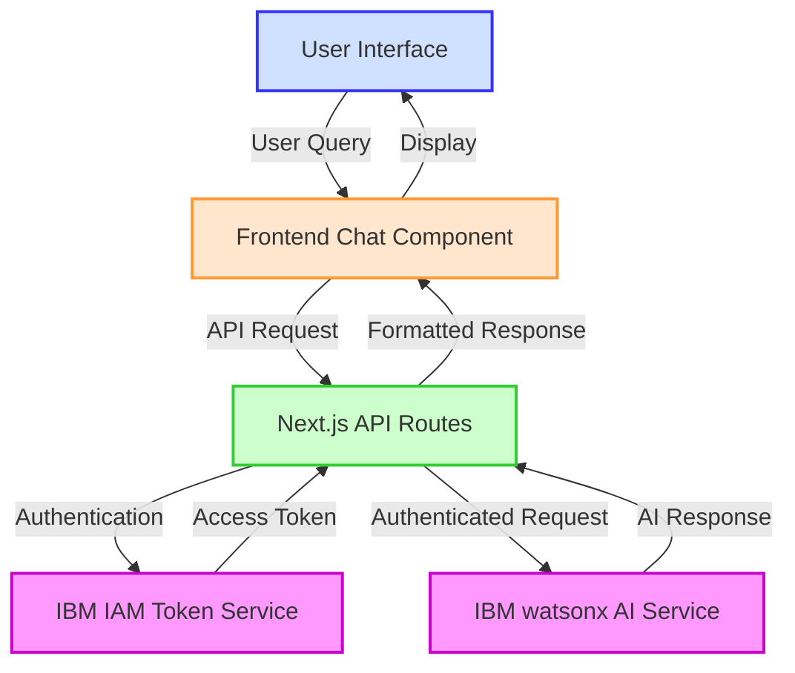
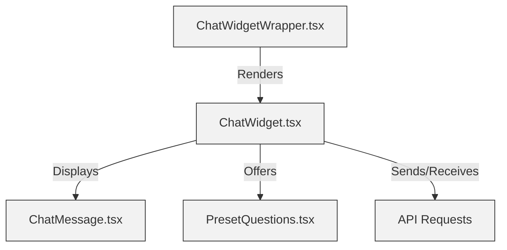
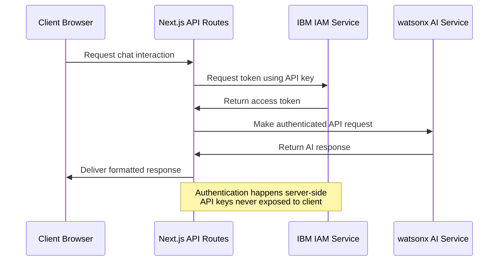
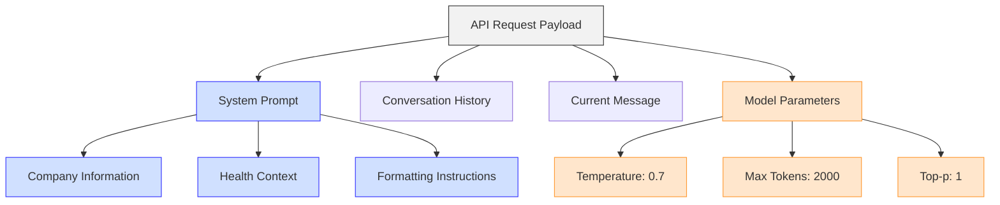
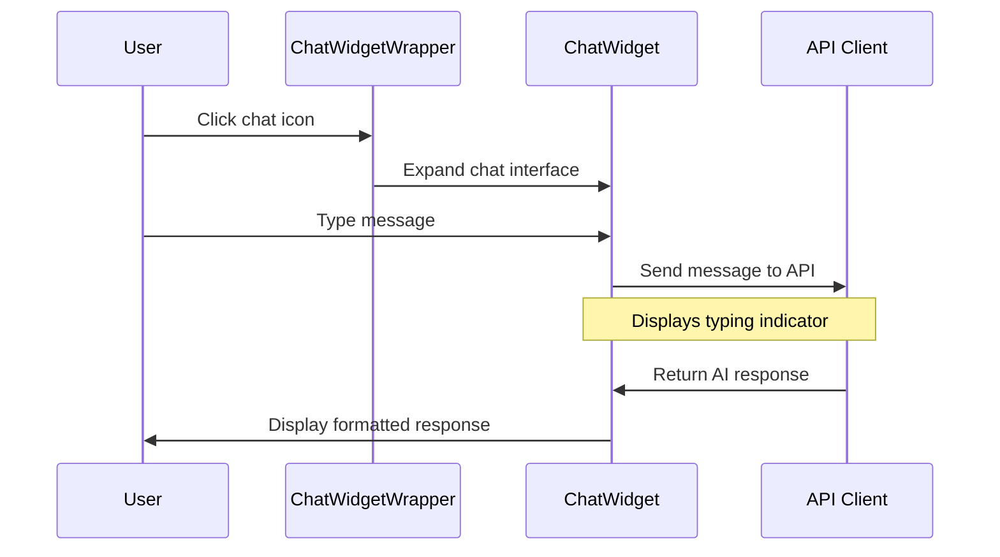
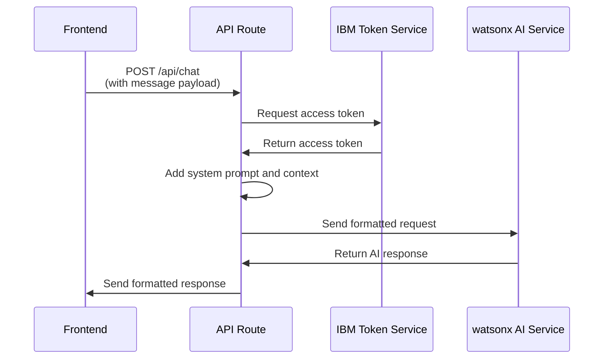
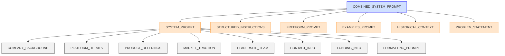
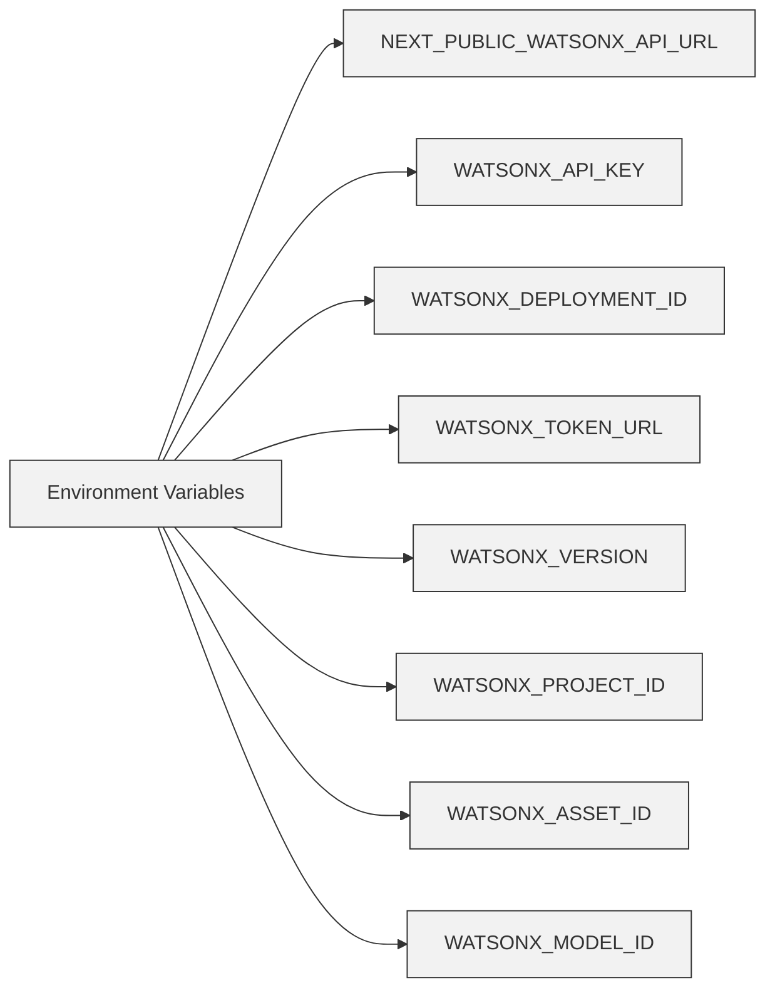
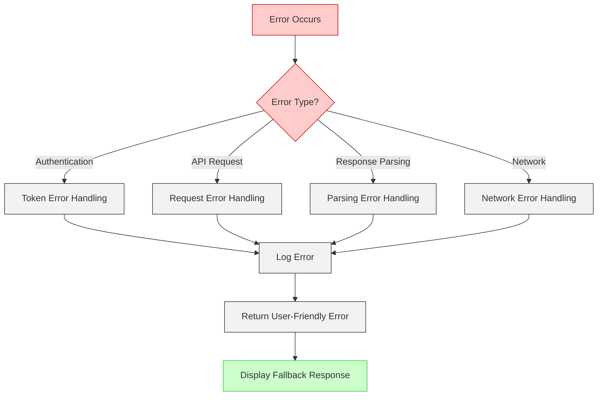
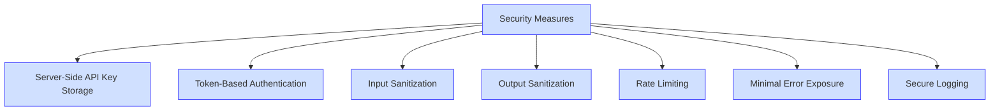

# IBM Cloud watsonx AI Integration Guide

## Introduction

This document provides a comprehensive overview of how IBM Cloud watsonx AI is integrated into the Sanicle Cloud platform. The integration brings powerful conversational AI capabilities to our women's health platform, enabling users to get immediate, accurate responses to health-related questions through an intuitive chat interface.

Sanicle Cloud's AI assistant leverages IBM's watsonx.ai platform to address women's health concerns in the workplace context, providing resources, information, and support through a sophisticated yet user-friendly interface.

## Integration Overview

Sanicle Cloud leverages IBM Cloud watsonx AI's language model capabilities to power an intelligent chat assistant that specializes in women's health topics for the workplace. This integration uses the Meta Llama 4 Maverick model (17B parameters) hosted on IBM's watsonx.ai platform, providing users with contextually relevant responses to health inquiries.



### Technology Stack

The integration relies on the following technology components:

| Component | Technology | Purpose |
|-----------|------------|---------|
| Frontend Framework | Next.js | Application framework and routing |
| UI Components | React | User interface components and state management |
| Styling | Tailwind CSS | UI design and responsive layout |
| Backend APIs | Next.js API Routes | Server-side processing and authentication |
| AI Model | Meta Llama 4 Maverick (17B) | Language model powering the assistant |
| AI Platform | IBM watsonx.ai | Model hosting and API services |
| Authentication | IBM Cloud IAM | Secure token-based authentication |
| Real-time Responses | Server-Sent Events (SSE) | Streaming chat responses |

## Key Components

The integration consists of several interconnected components that work together to deliver a seamless AI chat experience:

### 1. Frontend Chat Widget

The frontend implementation provides an intuitive user interface for interacting with the AI assistant:

- **ChatWidgetWrapper.tsx**: Controls the widget's mounting, visibility, and mobile responsiveness
- **ChatWidget.tsx**: Manages the chat interface, message history, and input handling
- **ChatMessage.tsx**: Renders individual messages with Markdown formatting
- **PresetQuestions.tsx**: Offers quick-access templates for common inquiries



#### ChatWidgetWrapper.tsx Implementation

This component serves as the entry point for the chat widget, handling mounting logic and device detection:

```typescript
// Simplified example of ChatWidgetWrapper.tsx
"use client";

import { Suspense, useState, useEffect } from "react";
import dynamic from "next/dynamic";

// Dynamic import to avoid SSR issues
const DynamicChatWidget = dynamic(
  () => import("./ChatWidget").then(mod => mod.ChatWidget),
  {
    ssr: false,
    loading: () => null
  }
);

export function ChatWidgetWrapper() {
  const [mounted, setMounted] = useState(false);
  const [isMobile, setIsMobile] = useState(false);
  const [isCollapsed, setIsCollapsed] = useState(true);

  useEffect(() => {
    setMounted(true);
    // Detect mobile devices to disable widget on small screens
    const isMobileDevice = /iPhone|iPad|iPod|Android|Mobile|webOS|BlackBerry/i.test(navigator.userAgent);
    const isSmallScreen = window.innerWidth < 768;
    setIsMobile(isMobileDevice && isSmallScreen);
  }, []);

  // Don't render on mobile or when not mounted
  if (!mounted || isMobile) return null;

  return (
    <Suspense fallback={null}>
      <DynamicChatWidget 
        isCollapsed={isCollapsed}
        toggleCollapsed={() => setIsCollapsed(prev => !prev)}
      />
    </Suspense>
  );
}
```

#### ChatWidget.tsx Key Features

The main chat widget component handles:

- User input processing and submission
- Message history management
- Expanding/collapsing the chat interface
- API communication with the backend
- Response rendering with Markdown support
- Preset question templates for common queries

### 2. Backend API Routes

The backend implementation securely communicates with IBM Cloud services:

- **Authentication Route** (`/api/ibm-token`): Obtains IBM Cloud IAM tokens
- **Standard Chat API** (`/api/chat`): Handles non-streaming chat requests
- **Streaming Chat API** (`/api/chat-stream`): Processes Server-Sent Events for real-time responses

```mermaid
graph TD
    A[Frontend] -->|Token Request| B[/api/ibm-token]
    A -->|Chat Request| C[/api/chat]
    A -->|Stream Request| D[/api/chat-stream]
    
    B -->|Fetch Token| E[IBM IAM Service]
    C -->|Process Request| F[IBM Chat API]
    D -->|Stream Response| G[IBM Streaming API]
    
    classDef frontend fill:#ffe6cc,stroke:#ff9933,stroke-width:1px
    classDef apiRoute fill:#ccffcc,stroke:#33cc33,stroke-width:1px
    classDef ibmService fill:#f9f,stroke:#c0c,stroke-width:1px
    
    class A frontend
    class B,C,D apiRoute
    class E,F,G ibmService
```

#### Token Route Implementation

The IBM IAM token route handles secure authentication with IBM Cloud:

```typescript
// Simplified example of /api/ibm-token/route.ts
import { NextResponse } from 'next/server';
import { WATSONX_CONFIG } from '@/lib/env';

export async function GET() {
  try {
    const response = await fetch(WATSONX_CONFIG.TOKEN_URL, {
      method: 'POST',
      headers: {
        'Content-Type': 'application/x-www-form-urlencoded',
        'Accept': 'application/json',
      },
      body: new URLSearchParams({
        'grant_type': 'urn:ibm:params:oauth:grant-type:apikey',
        'apikey': WATSONX_CONFIG.API_KEY,
      }),
    });

    if (!response.ok) {
      const errorData = await response.json();
      console.error('IBM token error:', errorData);
      return NextResponse.json(
        { error: 'Failed to fetch IBM token' },
        { status: response.status }
      );
    }

    const data = await response.json();
    return NextResponse.json({ access_token: data.access_token });
  } catch (error) {
    console.error('Error fetching IBM token:', error);
    return NextResponse.json(
      { error: 'Failed to fetch IBM token' },
      { status: 500 }
    );
  }
}
```

#### Chat API Implementation

The standard chat API route processes non-streaming requests:

```typescript
// Simplified example of /api/chat/route.ts
import { NextResponse } from 'next/server';
import { WATSONX_CONFIG } from '@/lib/env';
import { COMBINED_SYSTEM_PROMPT } from '@/lib/prompts';

export async function POST(req: Request) {
  try {
    const { messages } = await req.json();
    
    // Get IBM Cloud IAM token
    const tokenResponse = await fetch(WATSONX_CONFIG.TOKEN_URL, {
      method: 'POST',
      headers: { 'Content-Type': 'application/x-www-form-urlencoded' },
      body: `grant_type=urn:ibm:params:oauth:grant-type:apikey&apikey=${WATSONX_CONFIG.API_KEY}`
    });

    if (!tokenResponse.ok) {
      throw new Error('Failed to get IAM token');
    }

    const tokenData = await tokenResponse.json();
    const accessToken = tokenData.access_token;

    // Prepare message array with system prompt
    const messagesForAPI = [
      { role: "system", content: COMBINED_SYSTEM_PROMPT },
      ...messages.filter(msg => msg.role === 'user' || msg.role === 'assistant')
    ];
    
    // Set API endpoint
    const endpointUrl = `${WATSONX_CONFIG.API_URL}/ml/v1/text/chat?version=2023-05-29`;
    
    // Prepare request body
    const requestBody = {
      messages: messagesForAPI,
      model_id: WATSONX_CONFIG.MODEL_ID,
      project_id: WATSONX_CONFIG.PROJECT_ID,
      max_tokens: 2000,
      temperature: 0.7,
      top_p: 1
    };
    
    // Send request to watsonx AI
    const watsonResponse = await fetch(endpointUrl, {
      method: 'POST',
      headers: {
        'Content-Type': 'application/json',
        'Authorization': `Bearer ${accessToken}`
      },
      body: JSON.stringify(requestBody)
    });

    if (!watsonResponse.ok) {
      throw new Error(`Watson API error: ${watsonResponse.status}`);
    }

    const data = await watsonResponse.json();
    return NextResponse.json(data);
  } catch (error) {
    console.error('Error:', error);
    return NextResponse.json({ error: 'Failed to process request' }, { status: 500 });
  }
}
```

## Authentication Flow

The integration implements a secure token-based authentication system to ensure all interactions with IBM Cloud services are properly authorized:



The key security aspect of this flow is that all sensitive credentials and authentication happen exclusively on the server-side, ensuring API keys are never exposed to client browsers.

### Authentication Process Details

1. **API Key Storage**: The IBM Cloud API key is stored in the server environment variables
2. **Token Request**: When needed, the server requests an access token from IBM IAM
3. **Token Response**: IBM IAM returns a JWT token valid for a limited time (typically 1 hour)
4. **Token Usage**: The server uses this token to authenticate requests to IBM watsonx AI
5. **Token Renewal**: The server handles token expiration and renewal automatically

This approach ensures sensitive credentials never reach the client application, maintaining security while providing seamless access to AI capabilities.

## API Integration Details

The platform integrates with two primary watsonx.ai endpoints:

### Standard Chat API

Used for regular chat interactions when real-time streaming is not required:

```
POST https://us-south.ml.cloud.ibm.com/ml/v1/text/chat?version=2023-05-29
```

#### Request Payload Example

```json
{
  "messages": [
    {
      "role": "system",
      "content": "You are Sani, the official AI assistant for Sanicle.cloud, a B2B-B2G SaaS platform revolutionizing menstrual and menopause health in the workplace..."
    },
    {
      "role": "user",
      "content": "Can you tell me about the features Sanicle offers for menopause support?"
    }
  ],
  "model_id": "meta-llama/llama-4-maverick-17b-128e-instruct-fp8",
  "project_id": "f4f3c945-71a5-4467-852c-e56eae2dabd4",
  "max_tokens": 2000,
  "temperature": 0.7,
  "top_p": 1
}
```

#### Response Payload Example

```json
{
  "id": "cmpl-123456789",
  "object": "chat.completion",
  "created": 1684889015,
  "model": "meta-llama/llama-4-maverick-17b-128e-instruct-fp8",
  "choices": [
    {
      "index": 0,
      "message": {
        "role": "assistant",
        "content": "## Sanicle's Menopause Support Features\n\nSanicle Cloud offers several features specifically designed to support employees going through menopause in the workplace:\n\n* **Personalized Symptom Tracking**: Tools to monitor and manage menopause symptoms\n* **Educational Resources**: Comprehensive information about menopause transitions\n* **Workplace Accommodations**: Guidance for both employees and HR managers\n* **Expert Support**: Access to healthcare professionals specializing in menopause\n* **Peer Community**: Connect with others experiencing similar challenges\n\nThese features help create a more inclusive workplace environment where menopause is understood and appropriately accommodated."
      },
      "finish_reason": "stop"
    }
  ],
  "usage": {
    "prompt_tokens": 1024,
    "completion_tokens": 142,
    "total_tokens": 1166
  }
}
```

### Streaming Chat API

Used for real-time, token-by-token response generation:

```
POST https://us-south.ml.cloud.ibm.com/ml/v4/deployments/{deployment_id}/ai_service_stream?version={version}
```

The streaming API uses Server-Sent Events (SSE) to deliver tokens as they are generated, creating a more responsive user experience with typing-like effects. The response comes as a stream of data chunks that must be properly parsed and assembled on the client side.

Both endpoints use a similar request payload structure:



## Implementation Walkthrough

### 1. Frontend Implementation

The chat widget is implemented as a floating button in the bottom-right corner of the dashboard that expands into a full chat interface when clicked:



#### User Interaction Process

1. **Initial Rendering**: The chat widget appears as a minimized floating button in the bottom-right corner
2. **Widget Expansion**: When clicked, the widget expands to show the full chat interface
3. **Preset Questions**: Users can select from common questions or type their own
4. **Message Submission**: Upon sending a message, the UI displays a typing indicator
5. **Response Rendering**: AI responses are displayed with Markdown formatting
6. **History Management**: The conversation history is maintained within the session
7. **Widget Collapse**: Users can minimize the widget when not in use

### 2. Backend Implementation

The backend handles authentication and communication with IBM Cloud services:



#### Backend Processing Steps

1. **Request Reception**: The API route receives the chat message from the frontend
2. **Authentication**: The route obtains an IBM Cloud access token if needed
3. **Context Enhancement**: The system prompt and conversation history are added
4. **API Request**: The enhanced request is sent to the IBM watsonx AI service
5. **Response Processing**: The response from watsonx is processed and formatted
6. **Response Delivery**: The processed response is sent back to the frontend

For streaming responses, the backend establishes a Server-Sent Events connection that delivers tokens incrementally as they are generated by the model.

## System Prompt Architecture

The system prompt is a crucial component that defines the AI's capabilities, knowledge base, and response style:



This hierarchical structure ensures the AI assistant has comprehensive knowledge about Sanicle Cloud's offerings, women's health topics, and appropriate response formatting.

### System Prompt Content

The system prompt combines multiple components:

1. **Core Identity**: Defines the assistant's name, role, and purpose
2. **Company Information**: Details about Sanicle Cloud's history, mission, and offerings
3. **Health Knowledge**: Information about women's health topics, particularly menstrual and menopause health
4. **Tone Guidelines**: Instructions for maintaining an empathetic, professional tone
5. **Formatting Rules**: Guidelines for consistent Markdown formatting
6. **Boundary Setting**: Clarification on topics the assistant should avoid
7. **Fallback Responses**: Templates for handling questions outside its knowledge domain

The prompt is structured to provide a balance between specific knowledge and general capabilities, ensuring the assistant can handle a wide range of questions while maintaining accuracy and relevance.

### Example Prompt Component

Here's a simplified example of part of the system prompt structure:

```typescript
// Simplified excerpt from lib/prompts.ts
export const FORMATTING_PROMPT = `Format your responses using Markdown:
  - Use proper headers with ## for main titles and ### for subtitles
  - Format lists correctly with proper spacing
  - Use **bold** for emphasis
  - Separate paragraphs with blank lines
  - Use bullet points with * or - followed by a space
  - Number lists with 1. 2. etc. followed by a space
  - Format your response clearly and concisely`;

export const COMPANY_BACKGROUND = `
Sanicle.cloud is a B2B-B2G SaaS platform revolutionizing menstrual and menopause health in the workplace, addressing the $150 billion annual productivity losses related to these issues.

## Company History
- Founded by Chaste Inegbedion (known as "Mr. Padman") who started the organization in Nigeria as Padman Africa
- Led by CEO Dr. Omopeju Afanu
- Evolved from Nigerian roots providing doorstep product delivery, serving urban health centers, and advocacy that changed national laws
...`;

// Main system prompt combines all components
export const SYSTEM_PROMPT = `You are Sani, the official AI assistant for Sanicle.cloud, a B2B-B2G SaaS platform revolutionizing menstrual and menopause health in the workplace. Your purpose is to accurately represent Sanicle's mission, products, services, and values to website visitors.

${COMPANY_BACKGROUND}
${PLATFORM_DETAILS}
${PRODUCT_OFFERINGS}
...
${FORMATTING_PROMPT}`;

// Combined prompt for API calls
export const COMBINED_SYSTEM_PROMPT = `${SYSTEM_PROMPT}
${STRUCTURED_INSTRUCTIONS}
${FREEFORM_PROMPT}
${EXAMPLES_PROMPT}
${HISTORICAL_CONTEXT}
${PROBLEM_STATEMENT}`;
```

## Configuration Requirements

To implement the IBM watsonx AI integration, the following environment variables must be configured:



These variables should be placed in a `.env.local` file at the project root.

### Environment Variable Details

| Variable | Purpose | Example Value |
|----------|---------|---------------|
| NEXT_PUBLIC_WATSONX_API_URL | Base URL for API requests | https://us-south.ml.cloud.ibm.com/ml/v4/deployments |
| WATSONX_API_KEY | Authentication key for IBM Cloud | a1b2c3d4-e5f6-7890-a1b2-c3d4e5f6g7h8 |
| WATSONX_DEPLOYMENT_ID | ID of deployed LLM model | eaf22663-31f0-4ee8-994b-36bd2fedec20 |
| WATSONX_TOKEN_URL | URL for token acquisition | https://iam.cloud.ibm.com/identity/token |
| WATSONX_VERSION | API version date | 2021-05-01 |
| WATSONX_PROJECT_ID | ID of watsonx project | f4f3c945-71a5-4467-852c-e56eae2dabd4 |
| WATSONX_ASSET_ID | Asset ID if applicable | f2f75b87-0151-4d42-9bca-c5066c6209a4 |
| WATSONX_MODEL_ID | ID of the AI model to use | meta-llama/llama-4-maverick-17b-128e-instruct-fp8 |

### Environment Configuration Example

Create a `.env.local` file in the project root with the following content:

```
# IBM watsonx AI Configuration
NEXT_PUBLIC_WATSONX_API_URL=https://us-south.ml.cloud.ibm.com/ml/v4/deployments
WATSONX_API_KEY=your_api_key_here
WATSONX_DEPLOYMENT_ID=your_deployment_id_here
WATSONX_TOKEN_URL=https://iam.cloud.ibm.com/identity/token
WATSONX_VERSION=2021-05-01
WATSONX_PROJECT_ID=your_project_id_here
WATSONX_ASSET_ID=your_asset_id_here
WATSONX_MODEL_ID=meta-llama/llama-4-maverick-17b-128e-instruct-fp8
```

Replace placeholder values with your actual IBM Cloud credentials.

## Setup Process

```mermaid
graph TD
    A[Start] --> B[Create IBM Cloud Account]
    B --> C[Provision watsonx.ai Service]
    C --> D[Create Project]
    D --> E[Deploy Llama 4 Model]
    E --> F[Generate API Key]
    F --> G[Configure Environment Variables]
    G --> H[Test Integration]
    H --> I[End]
    
    classDef process fill:#f2f2f2,stroke:#333,stroke-width:1px
    classDef start fill:#d0e0ff,stroke:#3333ff,stroke-width:2px
    classDef end fill:#ffe6cc,stroke:#ff9933,stroke-width:2px
    
    class A start
    class B,C,D,E,F,G,H process
    class I end
```

### Detailed Setup Instructions

1. **Create IBM Cloud Account**
   - Go to [IBM Cloud](https://cloud.ibm.com/)
   - Sign up for an account or log in
   - Verify your email and set up account details

2. **Provision watsonx.ai Service**
   - Navigate to the IBM Cloud catalog
   - Search for "watsonx.ai" service
   - Select the appropriate plan for your needs
   - Complete the provisioning process

3. **Create Project**
   - In the watsonx.ai dashboard, create a new project
   - Name the project (e.g., "Sanicle-AI-Assistant")
   - Add project description and save

4. **Deploy Llama 4 Model**
   - Navigate to the Model Library in watsonx.ai
   - Find the Meta Llama 4 Maverick model (17B parameters)
   - Deploy the model to your project
   - Note the deployment ID for environment configuration

5. **Generate API Key**
   - Go to Manage > Access (IAM) in IBM Cloud dashboard
   - Select "API keys" from the left menu
   - Click "Create an IBM Cloud API key"
   - Name the key (e.g., "sanicle-watsonx-access")
   - Copy the generated API key (only shown once)

6. **Configure Environment Variables**
   - Create or modify `.env.local` file in your project
   - Add all required environment variables as detailed above
   - Ensure sensitive values are never committed to version control

7. **Test Integration**
   - Start your development server
   - Navigate to a page with the chat widget
   - Send a test message to verify connection
   - Check developer console for any errors

## Error Handling

The integration includes comprehensive error handling at various levels:



### Error Types and Handling Strategies

| Error Type | Description | Handling Strategy |
|------------|-------------|-------------------|
| Authentication | Failed to obtain IBM IAM token | Log error, retry with exponential backoff, show generic error to user |
| API Request | Error when calling watsonx AI API | Log detailed error, display appropriate message to user |
| Response Parsing | Unexpected response format | Implement fallback parsing logic, return best-effort response |
| Network | Connection issues | Show offline status, cache recent interactions, retry when online |
| Rate Limiting | Too many requests to API | Implement request queuing, inform user of delay |
| Parameter Validation | Invalid input parameters | Sanitize inputs, provide default values where possible |

### Fallback Mechanisms

The integration includes multiple fallback strategies:

1. **Cached Responses**: For common queries, maintain cached responses
2. **Degraded Mode**: Simplified operation when full capabilities are unavailable
3. **Offline Support**: Basic functionality when network connection is lost
4. **Alternative Models**: Fallback to smaller, less capable but more reliable models
5. **Static Responses**: Pre-defined answers for critical functionality

## Performance Optimization

To ensure optimal performance, the integration implements the following strategies:

### Frontend Optimizations

1. **Dynamic Loading**: Chat widget loads only when needed
2. **Code Splitting**: Components are loaded on demand
3. **Debounced Input**: Prevents excessive API calls during typing
4. **Response Caching**: Common responses are cached locally
5. **State Management**: Efficient React state updates to minimize re-renders

### Backend Optimizations

1. **Token Caching**: IBM IAM tokens are cached until near expiration
2. **Stream Processing**: Efficient handling of streamed responses
3. **Request Batching**: Combines multiple requests when possible
4. **Response Compression**: Minimizes data transfer between services

## Security Considerations



### Security Implementation Details

1. **API Key Protection**:
   - API keys are stored exclusively in server environment variables
   - Keys are never exposed to client-side code
   - Separate development and production keys with appropriate restrictions

2. **Token Management**:
   - Token requests occur server-side only
   - Tokens are short-lived and automatically rotated
   - Token validation for all IBM Cloud API requests

3. **Data Protection**:
   - User chat data is encrypted in transit
   - Personal health information is handled according to privacy regulations
   - Data minimization practices are implemented

4. **Input/Output Safety**:
   - All user inputs are sanitized before processing
   - AI responses are checked for harmful content
   - Content filtering prevents inappropriate information

## Monitoring and Maintenance

To ensure the ongoing health of the integration, implement the following practices:

1. **API Usage Monitoring**: Track API call volume, response times, and error rates
2. **Token Health Checks**: Verify token refreshing is functioning properly
3. **Model Performance Evaluation**: Regularly assess the quality of AI responses
4. **Log Analysis**: Review logs for patterns indicating issues
5. **Version Management**: Keep dependencies up to date with IBM Cloud changes

## Troubleshooting Guide

| Issue | Possible Causes | Resolution Steps |
|-------|----------------|------------------|
| Widget not appearing | Mobile device detected, JS disabled, CSS issue | Check device detection logic, verify JS is enabled, inspect CSS |
| Authentication errors | Invalid API key, network issues, IBM service down | Verify API key, check network connection, check IBM service status |
| Empty or error responses | Model configuration issue, large input, rate limiting | Review model settings, check input size, implement rate limit handling |
| Slow responses | Network latency, large model, complex query | Optimize network calls, consider smaller model, simplify queries |
| Incorrect information | Outdated system prompt, model hallucination | Update system prompt, implement fact-checking, add examples |

## Data Flow Architecture

This diagram illustrates the complete data flow from user input to AI response:

```mermaid
flowchart TD
    A[User Input] -->|1. Send Message| B[ChatWidget.tsx]
    B -->|2. API Request| C[/api/chat or /api/chat-stream]
    C -->|3. Request Token| D[/api/ibm-token]
    D -->|4. Token Request| E[IBM IAM Service]
    E -->|5. Access Token| D
    D -->|6. Access Token| C
    C -->|7. Add System Prompt| F[Prepare Request]
    F -->|8. Authenticated Request| G[IBM watsonx AI]
    G -->|9. AI Response| C
    C -->|10. Format Response| B
    B -->|11. Display Response| H[User Interface]
    
    classDef user fill:#f2f2f2,stroke:#333,stroke-width:1px
    classDef frontend fill:#ffe6cc,stroke:#ff9933,stroke-width:1px
    classDef backend fill:#ccffcc,stroke:#33cc33,stroke-width:1px
    classDef ibm fill:#d0e0ff,stroke:#3333ff,stroke-width:2px
    
    class A,H user
    class B frontend
    class C,D,F backend
    class E,G ibm
```

## Advanced Customization

The integration can be further customized in several ways:

1. **Custom Model Fine-tuning**: Train the model on domain-specific data
2. **System Prompt Engineering**: Refine the prompt for better responses
3. **Conversation History Management**: Implement persistent conversations
4. **UI Customization**: Adapt the chat widget appearance
5. **Multi-language Support**: Add support for additional languages

## Conclusion

The IBM Cloud watsonx AI integration in Sanicle Cloud provides a powerful, secure, and user-friendly way to access women's health information in the workplace. By leveraging IBM's advanced language models with custom health-focused system prompts, we've created an intelligent assistant that provides valuable support while maintaining strict privacy and security standards.

This integration demonstrates the power of combining cutting-edge AI technology with domain-specific knowledge to create solutions that address real workplace health challenges. The careful architecture balances performance, security, and user experience to deliver a seamless AI-powered health assistant.

## Resources

- [IBM Cloud watsonx AI Documentation](https://cloud.ibm.com/docs/watsonx-ai)
- [Meta Llama 4 Model Information](https://ai.meta.com/resources/models-and-libraries/llama/)
- [Next.js API Routes Documentation](https://nextjs.org/docs/api-routes/introduction)
- [Mermaid Diagram Syntax](https://mermaid-js.github.io/mermaid/#/) 